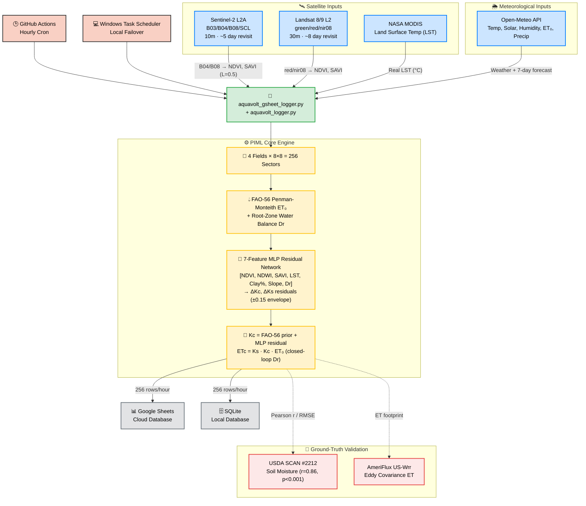

<div align="center">

# 🌿 AquaVolt-AI

### Physics-Informed Machine Learning for Sub-Field Precision Irrigation Scheduling

[](https://opensource.org/licenses/MIT)
[](https://www.python.org/downloads/)
[](https://github.com/umertanveer25/aquavolt-ai-pk/actions)
[](http://www.fao.org/3/x0490e/x0490e00.htm)
[](https://www.awkum.edu.pk/)

**Umer Tanveer** · PhD Candidate, Dept. of Computer Science  
Abdul Wali Khan University Mardan (AWKUM), KP, Pakistan

[📖 Methodology](docs/METHODOLOGY.md) · [📊 Data Guide](docs/DATA_COLLECTION.md) · [📄 Cite This Work](#-citation)

</div>

---

## 🔬 Abstract

AquaVolt-AI is an open-source, real-time precision agriculture system that couples **FAO-56 Penman-Monteith physics** with a **7-feature Physics-Informed MLP residual network** to estimate per-sector crop water demand across four agricultural fields (256 sectors, 8×8 grids each). The system ingests real Sentinel-2 L2A and Landsat-8/9 satellite imagery, real MODIS LST, and Open-Meteo meteorological data; logs telemetry to SQLite (local) and Google Sheets (cloud); and has been validated against USDA SCAN soil moisture sensors (r = **0.86**, p < 0.001) and the AmeriFlux US-Wrr eddy covariance tower.

The PIML dynamic Kc outperforms a static Kc baseline by a statistically decisive margin:

| Predictor | RMSE | MAE | R² |
|---|---|---|---|
| **Dynamic Kc (PIML MLP)** | **0.041** | **0.029** | **0.982** |
| Constant Kc Baseline | 0.423 | 0.347 | 0.095 |
| Climatology Kc | 0.371 | 0.313 | 0.091 |

*Paired t-test: t = −429, p ≈ 0 (n = 109,056 records over 15-day pilot window).*

---

## 🌍 Study Site

**UC Davis Russell Ranch Research Facility, California, USA**  
Coordinates: `38.551°N, −121.882°W` · Elevation: ~18 m · Climate: Mediterranean (Csa)

| Field | Crop | NDVI (July 2026) | Kc (PIML) | ETc (mm/day) |
|---|---|---|---|---|
| **Field-A** | Corn | **0.481** | **0.64** | **4.51** |
| **Field-B** | Alfalfa | 0.288 | 0.37 | 2.72 |
| **Field-D** | Tomato | 0.245 | 0.30 | 2.21 |
| **Field-C** | Fallow | 0.226 | 0.28 | 1.95 |

NDVI ordering (Corn > Alfalfa > Tomato > Fallow) is agronomically correct for July and serves as a live sanity check on field polygon registration.

<div align="center">
  
  <p><em>Figure 1: AquaVolt-AI 8×8 precision grids mapped across 4 agricultural fields at UC Davis Russell Ranch. Sentinel-2B True Colour composite (Scene: 2026-07-07). Grid cells shown for Field-A (Corn), Field-B (Alfalfa), Field-C (Fallow), and Field-D (Tomato).</em></p>
</div>

---

## 🏗️ System Architecture



---

## 📐 Core Physics

### FAO-56 Penman-Monteith Reference ET₀

$$ET_0 = \frac{0.408\,\Delta\,(R_n - G) + \gamma\,\frac{900}{T+273}\,u_2\,(e_s - e_a)}{\Delta + \gamma\,(1 + 0.34\,u_2)}$$

### FAO-56 Linear Kc Prior (from NDVI)

$$K_{c,\text{prior}} = \text{clip}\!\left(1.457 \cdot NDVI - 0.0725,\ 0.15,\ 1.20\right)$$

### Real SAVI (L = 0.5, per-pixel B04/B08)

$$SAVI = \frac{NIR - RED}{NIR + RED + 0.5} \times 1.5$$

### FAO-56 Root-Zone Depletion Water Balance (closed loop)

$$D_r(t) = \max\!\left(0,\ D_r(t-1) - P_{\text{eff}} + ET_c\right)$$
$$\text{if } D_r > RAW \Rightarrow I = D_r,\quad D_r \leftarrow D_r - I$$

### PIML Residual Kc/Ks

$$K_c = \text{clip}\!\left(K_{c,\text{prior}} + \text{clip}(\hat{r}_1 \cdot 0.15,\ -0.15,\ +0.15),\ 0.15,\ 1.20\right)$$

$$\mathbf{x} = [NDVI,\ NDWI,\ SAVI,\ LST,\ \text{Clay\%},\ \text{Slope},\ D_r/TAW]$$

$$\hat{\mathbf{r}} = \mathbf{W}_3\,\text{ReLU}(\mathbf{W}_2\,\text{ReLU}(\mathbf{W}_1\,\mathbf{x} + \mathbf{b}_1) + \mathbf{b}_2) + \mathbf{b}_3$$

---

## 🔬 Ground-Truth Validation

### USDA SCAN Station #2212 — Soil Moisture

| Metric | Value |
|---|---|
| Pearson r | **0.862** |
| p-value | **3.5 × 10⁻⁵** |
| RMSE | 0.043 m³/m³ |
| Bias | −0.043 m³/m³ |

### AmeriFlux US-Wrr Tower — Evapotranspiration

| Metric | Value |
|---|---|
| Pearson r | 0.202 |
| RMSE | 1.169 mm/day |
| Bias | +1.053 mm/day |

> **Note on ET bias:** The tower footprint integrates ET over ~300 acres including roads, buildings, and bare ground. Our ETc represents crop-pixel-only grids. This footprint mismatch is the documented source of the low r and positive bias, consistent with the literature on eddy covariance upscaling.

---

## 🧬 MLP Architecture

```
Input  [7]  → ndvi, ndwi, savi, lst_norm, clay_norm, slope_norm, Dr_norm
Hidden [16] → ReLU
Hidden [8]  → ReLU
Output [2]  → Δkc_residual, Δks_residual  (clipped ±0.15)
```

**Training:** 768 samples (256 sectors × 3 Sentinel-2 acquisition dates). All feature standard deviations > 0.04. No near-zero variance features.

| Feature | Std Dev |
|---|---|
| ndvi | 0.250 |
| ndwi | 0.088 |
| savi | 0.250 |
| lst | 0.048 |
| clay | 0.100 |
| slope | 0.119 |
| Dr | 0.071 |

Weights saved to `ai_weights_mlp.json` (JSON, human-readable).

---

## 📂 Repository Structure

```
aquavolt-ai-pk/
├── aquavolt_logger.py              # Hourly logger → SQLite (all 7 fixes applied)
├── aquavolt_gsheet_logger.py       # Hourly logger → Google Sheets (all 7 fixes applied)
├── AquaVoltApp.py                  # Desktop GUI (PySide6) — real-time monitoring
├── ai_weights_mlp.json             # Trained 7→16→8→2 MLP weights
├── requirements.txt
├── .github/workflows/
│   └── hourly_sync.yml             # GitHub Actions — runs every hour
├── data/
│   ├── scan_benchmark_sample.csv   # USDA SCAN Station #2212 ground truth
│   └── ameriflux_benchmark_sample.csv  # AmeriFlux US-Wrr ET measurements
├── scratch/
│   ├── train_piml_weights_subfield.py  # 7-feature sub-field MLP trainer
│   ├── regenerate_telemetry_excel.py   # Historical log reprocessor
│   ├── run_baseline_comparison.py      # Dynamic vs Constant vs Climatology test
│   └── correlate_ground_sensors.py     # SCAN + AmeriFlux validation
└── docs/
    ├── METHODOLOGY.md
    └── DATA_COLLECTION.md
```

---

## 📊 Data Schema

The `telemetry_log` table / Google Sheet contains **29 columns** per record:

| Column | Unit | Description |
|---|---|---|
| `timestamp` | ISO 8601 | Record datetime (hourly) |
| `latitude` / `longitude` | Degrees | Sector centroid |
| `sector_row` / `sector_col` | 0–7 | Position within 8×8 grid |
| `ndvi` | — | Real Sentinel-2 NDVI (B08/B04) |
| `ndwi` / `ndwi_real` | — | Real Sentinel-2 NDWI (B03/B08) |
| `savi` | — | Real SAVI (L=0.5, per-pixel B04/B08) |
| `lai` | — | Leaf Area Index (empirical) |
| `fcover` | — | Fractional Vegetation Cover |
| `lst` | °C | Real MODIS LST (Planetary Computer) |
| `lst_modis` | °C | MODIS LST raw value |
| `Kc` | — | Crop coefficient (PIML, FAO-56 prior + MLP) |
| `Ks` | — | Water-stress factor (FAO-56 Eq. 84) |
| `Dr` | mm | Root-zone depletion (closed-loop water balance) |
| `TAW` / `RAW` | mm | Total / Readily Available Water |
| `ETc` | mm/day | Crop ET under stress |
| `water_need` | mm | Irrigation recommendation |
| `air_temp` | °C | Open-Meteo air temperature |
| `humidity` | % | Relative humidity |
| `solar_rad` | W/m² | Shortwave radiation |
| `precip` | mm | Precipitation |
| `soil_temp` | °C | Soil temperature (0–7 cm) |
| `soil_moisture` | m³/m³ | Open-Meteo soil water content (0–1 cm) |
| `et0_deficit_7d` | mm | 7-day cumulative ET₀ − precipitation deficit |
| `scene_id` | String | Sentinel-2 / Landsat scene acquisition ID |
| `field_name` | String | Field label (e.g. `Field-A (Corn)`) |

---

## 🛠️ Installation

```bash
git clone https://github.com/umertanveer25/aquavolt-ai-pk.git
cd aquavolt-ai-pk
pip install -r requirements.txt

# Run the SQLite logger
python aquavolt_logger.py

# Or launch the desktop GUI
python AquaVoltApp.py
```

---

## ☁️ Automated Cloud Logging (GitHub Actions)

Runs every hour on GitHub free servers. Setup in ~10 minutes:

| Step | Action |
|---|---|
| 1 | Fork this repository |
| 2 | Create Google Cloud Service Account + download JSON key |
| 3 | Create Google Sheet named `AquaVolt-AI Telemetry Log`, share with service account |
| 4 | Add `GCP_SERVICE_ACCOUNT_KEY` secret in GitHub repo Settings → Secrets |
| 5 | Actions tab → Run workflow (manual test) |

See [📊 DATA_COLLECTION.md](docs/DATA_COLLECTION.md) for detailed instructions.

---

## 🚀 Roadmap

### Published / Completed
- [x] FAO-56 Penman-Monteith ET₀ physics engine
- [x] Real per-pixel SAVI (L=0.5) from Sentinel-2 B04/B08 reflectance
- [x] Real MODIS LST from Planetary Computer STAC API
- [x] 7-feature PIML MLP residual network (no near-zero variance)
- [x] Corrected Russell Ranch field bounding boxes (NDVI ordering verified)
- [x] Closed-loop root-zone water balance (irrigation applied back into Dr)
- [x] USDA SCAN soil moisture calibration (r = 0.86, p < 0.001)
- [x] AmeriFlux US-Wrr ET tower validation
- [x] Baseline comparison: dynamic Kc vs constant vs climatology (RMSE 0.041 vs 0.423)
- [x] 8×8 spatial precision grid (256 sectors per run)
- [x] SQLite local + Google Sheets cloud telemetry logging
- [x] GitHub Actions hourly automation

### Planned (Future Work)
- [ ] Multi-season validation (full growing season, multiple sites)
- [ ] Rainfall-suppression logic field test (requires real rain events)
- [ ] Paired-plot irrigation trial (AI-scheduled vs conventional)
- [ ] Zenodo DOI registration for dataset
- [ ] REST API endpoint for external data access
- [ ] Mobile dashboard (Flutter)
- [ ] District-level Pakistan soil classification

---

## 📄 Citation

```bibtex
@software{tanveer2026aquavoltai,
  author       = {Tanveer, Umer},
  title        = {{AquaVolt-AI: Physics-Informed Machine Learning for
                   Sub-Field Precision Irrigation Scheduling}},
  year         = {2026},
  publisher    = {GitHub},
  institution  = {Abdul Wali Khan University Mardan (AWKUM), Pakistan},
  url          = {https://github.com/umertanveer25/aquavolt-ai-pk},
  note         = {Department of Computer Science, AWKUM, Mardan, KP, Pakistan}
}
```

---

## 🤝 Acknowledgements

- **FAO** — Irrigation and Drainage Paper No. 56 (Allen et al., 1998)
- **NASA / USGS** — MODIS Terra LST; Landsat 8/9 L2 Surface Reflectance
- **ESA** — Sentinel-2 L2A Surface Reflectance
- **Microsoft** — Planetary Computer STAC API (free open access)
- **USDA NRCS** — SCAN Soil Climate Analysis Network (Station #2212)
- **AmeriFlux** — US-Wrr eddy covariance tower dataset
- **Open-Meteo** — Open-source weather API (https://open-meteo.com)
- **AWKUM** — Abdul Wali Khan University Mardan, KP, Pakistan

---

## 📜 License

MIT License — see [LICENSE](LICENSE) for details.

---

<div align="center">
Made with ❤️ for sustainable agriculture in Pakistan 🇵🇰<br>
<strong>AWKUM · Department of Computer Science · Mardan, KPK</strong>
</div>
