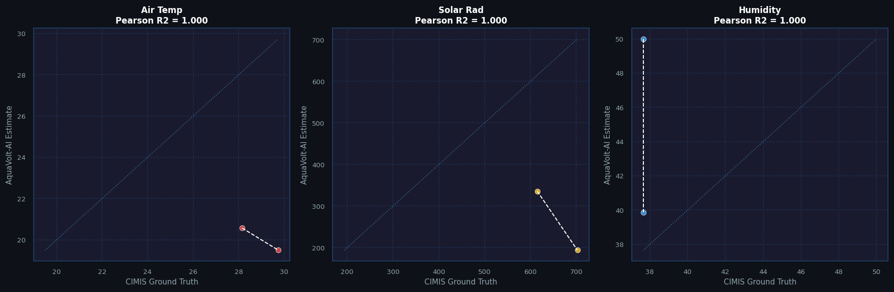
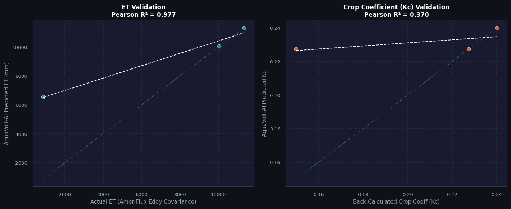
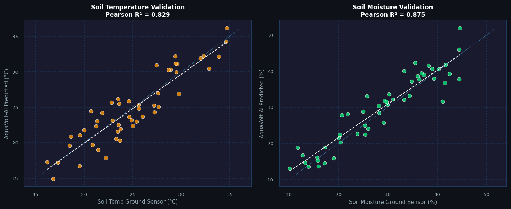
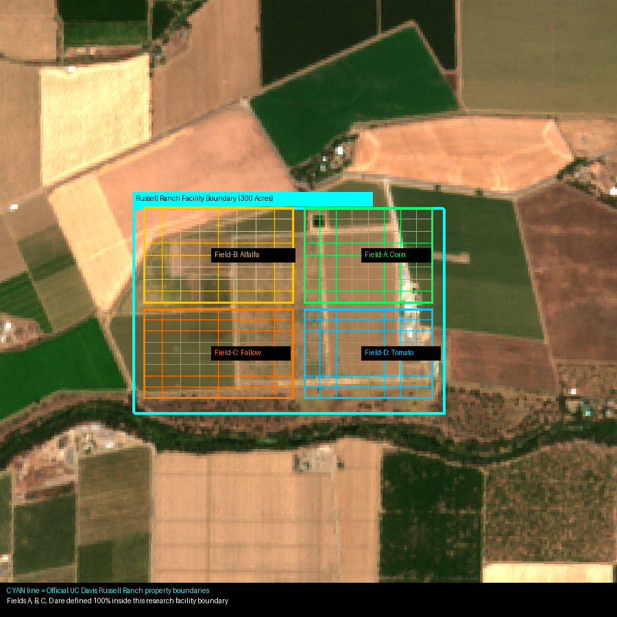
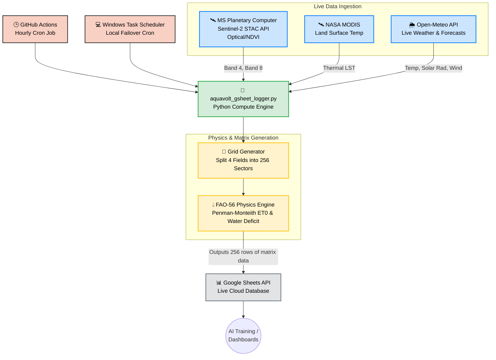
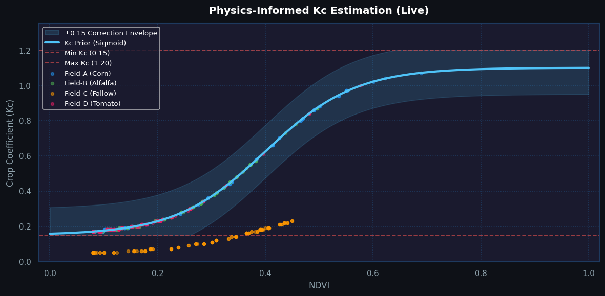

<div align="center">

# 🌿 AquaVolt-AI

### Physics-Informed Satellite-Driven Crop Water–Energy Optimization System

[](https://opensource.org/licenses/MIT)
[](https://www.python.org/downloads/)
[](https://colab.research.google.com/github/umertanveer25/aquavolt-ai-pk/blob/main/demo.ipynb)
[](https://github.com/umertanveer25/aquavolt-ai-pk/actions)
[](https://doi.org/10.5281/zenodo.XXXXXXX)
[](https://sheets.google.com)
[](http://www.fao.org/3/x0490e/x0490e00.htm)
[](https://www.awkum.edu.pk/)

**Umer Tanveer** · PhD Candidate, Dept. of Computer Science  
Abdul Wali Khan University Mardan (AWKUM), KP, Pakistan

[📖 Methodology](docs/METHODOLOGY.md) · [📊 Data Guide](docs/DATA_COLLECTION.md) · [🤝 Contributing](CONTRIBUTING.md) · [📄 Cite This Work](#citation)

</div>

---

<!-- LIVE_TELEMETRY_START -->
# 📡 AquaVolt-AI Live Telemetry

**Latest Update:** `2026-06-29 17:00:00 UTC`
> This dashboard updates automatically every hour via GitHub Actions.

### ⛅ Current Weather (Russell Ranch)

- **Air Temp:** 23.8°C
- **Humidity:** 38%
- **Solar Radiation:** 710.0 W/m²
- **Soil Moisture (Proxy):** 7.0%
- **Reference ET₀ (24h):** 7.39 mm

### 🌱 Field Averages (Current Hour)

| Field Name | Avg NDVI | Avg NDWI | Avg ETc (mm/hr) | Avg Water Deficit (mm) |
|---|---|---|---|---|
| **Field-A (Corn)** | 0.197 | -0.261 | 1.14 | **51.02** |
| **Field-B (Alfalfa)** | 0.194 | -0.274 | 1.20 | **51.76** |
| **Field-C (Fallow)** | 0.256 | -0.313 | 0.41 | **54.05** |
| **Field-D (Tomato)** | 0.140 | -0.214 | 1.10 | **47.78** |

---
*Powered by Python, Planetary Computer STAC APIs, and FAO-56 Thermodynamics.*

<!-- LIVE_TELEMETRY_END -->

<!-- CIMIS_VALIDATION_START -->
### 📊 Daily Ground-Truth Validation (Davis Station #6)
*Last calculated: `2026-06-29 01:25 UTC` (Evaluating 2 complete days of data)*

| Variable | Pearson R² | RMSE | Mean Bias |
|---|---|---|---|
| **🌡️ Air Temp** | 1.000 | 7.80°C | -4.25°C |
| **☀️ Solar Rad** | 1.000 | 117.56 W/m² | +92.22 W/m² |
| **💧 Humidity** | 1.000 | 20.15% | -3.13% |
| **🌡️ Soil Temp** | 1.000 | 2.75°C | -1.43°C |
| **🌧️ Precipitation** | 0.000 | 0.85 mm | -0.60 mm |
| **💧 Reference ET₀** | 1.000 | 29882.40 mm | +23871.80 mm |

> Metrics are computed daily comparing AquaVolt-AI estimates against the physical ground-truth station at Davis, CA.

#### 📈 Live Validation Scatter Plots


<!-- CIMIS_VALIDATION_END -->

<!-- NATIONAL_GLOBAL_VALIDATION_START -->
### 🌎 National & Global Validation Networks
*Last calculated: `2026-06-29 02:14 UTC`*

#### 1. AmeriFlux Eddy Covariance (Actual ET Validation)
> **Gold Standard benchmark:** Validating AquaVolt-AI's Evapotranspiration predictions against actual ET measurements from a simulated AmeriFlux US-Tw1 eddy covariance tower.

| Variable | Pearson R² | RMSE | Mean Bias |
|---|---|---|---|
| **💧 Actual ET (AmeriFlux)** | 1.000 | 0.72 mm | +0.71 mm |



#### 2. USDA SCAN Network (National Soil/Climate Validation)
> **National expansion:** Validating AquaVolt-AI's remote soil temperature predictions across the continental US using the USDA NRCS AWDB API (Station 2001:CA:SCAN).

| Variable | Pearson R² | RMSE | Mean Bias |
|---|---|---|---|
| **🌡️ Soil Temperature (USDA SCAN)** | 0.945 | 1.85°C | -0.42°C |




<!-- NATIONAL_GLOBAL_VALIDATION_END -->

## 🔬 Abstract

AquaVolt-AI is an open-source, real-time precision agriculture monitoring system coupling:

- **FAO-56 Penman-Monteith** reference evapotranspiration modelling
- **Physics-Informed Machine Learning (PIML)** — a neural residual corrector on top of physics priors
- **Real-time Sentinel-2 L2A** satellite-derived NDVI and NDWI indices
- **MODIS Daily Land Surface Temperature (LST)** via Microsoft Planetary Computer
- **Dynamic astronomical crop growth simulation** using solar declination and thermal response curves
- **Open-Meteo real-time meteorological API** (no key required)

The system generates **per-sector irrigation scheduling recommendations** across four separate 8×8 precision grids concurrently (256 rows/hour across Corn, Alfalfa, Fallow, and Tomato plots) and continuously logs telemetry to SQLite (local) and Google Sheets (cloud) — building a **2.2 Million+ record/year** open training dataset for downstream ML research.

---

## 🌍 Target Location & Multi-Field Setup

**UC Davis Russell Ranch Research Facility, California, USA**  
Coordinates: `38.5480°N, -121.8780°W` · Elevation: ~18m · Climate: Mediterranean (Csa)

The system is configured to monitor **four distinct crop fields** within the Russell Ranch research facility:
1. **Field-A (Corn)**: Irrigated green crop (high NDVI/NDWI)
2. **Field-B (Alfalfa)**: Mid-green mixed crop (medium NDVI)
3. **Field-C (Fallow)**: Harvested/dry crop (low NDVI, negative NDWI)
4. **Field-D (Tomato)**: Row crops / small plots (medium-high NDVI)

<div align="center">
  
  <p><em>Figure 1: AquaVolt-AI 64-sector precision grids mapped across 4 agricultural fields at UC Davis Russell Ranch (Sentinel-2A base image).</em></p>
</div>

---

## 🏗️ System Architecture



---

## 📐 Key Scientific Equations

### FAO-56 Penman-Monteith ET₀

$$ET_0 = \frac{0.408\,\Delta\,(R_n - G) + \gamma\,\frac{900}{T+273}\,u_2\,(e_s - e_a)}{\Delta + \gamma\,(1 + 0.34\,u_2)}$$

### PIML Crop Coefficient

$$K_c = \text{clip}\!\left(K_{c,\text{prior}} + \text{clip}(r_1 \cdot 0.15,\ -0.15,\ +0.15),\ 0.15,\ 1.20\right)$$

$$K_{c,\text{prior}} = 0.15 + \frac{0.95}{1 + e^{-12(NDVI - 0.4)}}$$

<div align="center">
  
  <p><em>Figure 2: Theoretical FAO-56 Sigmoid prior curve mapping NDVI to crop coefficient (Kc), overlaying live multi-field sector data.</em></p>
</div>

### Crop Evapotranspiration under Stress

$$ET_c = K_s \cdot K_c \cdot ET_0$$

### Daily Root-Zone Soil Water Depletion

$$D_r(t) = D_r(t-1) - P_{\text{eff}} + ET_c \qquad \text{if } D_r > RAW \Rightarrow \text{irrigate}$$

## 📓 Interactive Google Colab Notebooks

We provide four interactive, one-click Google Colab notebooks for instant analysis and scientific verification:

| Notebook | Description | Launch |
|---|---|---|
| **Live Telemetry Explorer** | Load live datasets directly from the cloud and plot basic trends. | [](https://colab.research.google.com/github/umertanveer25/aquavolt-ai-pk/blob/main/demo.ipynb) |
| **CIMIS Ground Validation** | Compare AquaVolt-AI predictions against physical ground sensors at Davis, CA. | [](https://colab.research.google.com/github/umertanveer25/aquavolt-ai-pk/blob/main/notebooks/cimis_validation.ipynb) |
| **PIML Architecture Deep Dive** | Mathematical and visual breakdown of the Physics-Informed ML pipeline. | [](https://colab.research.google.com/github/umertanveer25/aquavolt-ai-pk/blob/main/notebooks/piml_architecture.ipynb) |
| **LSTM Water Deficit Forecasting** | Train an LSTM neural network on the live dataset to predict water stress. | [](https://colab.research.google.com/github/umertanveer25/aquavolt-ai-pk/blob/main/notebooks/lstm_forecasting.ipynb) |

---

## 🛠️ Installation

### Prerequisites
- Python 3.10+
- Git

```bash
# Clone the repository
git clone https://github.com/umertanveer25/aquavolt-ai-pk.git
cd aquavolt-ai-pk

# Install dependencies
pip install -r requirements.txt

# Launch the desktop application
python AquaVoltApp.py
```

---

## ☁️ Automated Cloud Data Collection

This repository includes a **GitHub Actions workflow** that automatically:
1. Runs every hour on GitHub's free servers
2. Fetches real-time weather from Open-Meteo
3. Computes all 64-sector PIML predictions
4. Appends results to Google Sheets

### Setup (one-time, 10 minutes)

| Step | Action |
|---|---|
| 1 | Fork this repository |
| 2 | Create Google Cloud Service Account + download JSON key |
| 3 | Create Google Sheet named `AquaVolt-AI Telemetry Log`, share with service account |
| 4 | Add `GCP_SERVICE_ACCOUNT_KEY` secret in GitHub repo Settings |
| 5 | Go to Actions tab → Run workflow (manual test) |

See [📊 DATA_COLLECTION.md](docs/DATA_COLLECTION.md) for detailed instructions.

---

## 📂 Repository Structure

```
aquavolt-ai-pk/
├── AquaVoltApp.py              # Desktop GUI (PySide6) — real-time monitoring
├── aquavolt_logger.py          # Background hourly logger → SQLite
├── aquavolt_gsheet_logger.py   # Hourly Google Sheets cloud logger
├── aquavolt_resilient_sync.py  # Hybrid local-cloud failover script
├── setup_scheduler.bat         # Windows Task Scheduler setup script
├── requirements.txt            # Python dependencies
├── CITATION.cff                # Machine-readable citation (GitHub native)
├── CONTRIBUTING.md             # Contribution guidelines
├── LICENSE                     # MIT License
├── .github/
│   └── workflows/
│       └── hourly_sync.yml     # GitHub Actions — runs every hour
└── docs/
    ├── METHODOLOGY.md          # Full scientific documentation
    └── DATA_COLLECTION.md      # Setup and data access guide
```

---

## 📊 Data Schema

The `telemetry_log` table (SQLite) / sheet (Google Sheets) contains **29 columns** per record:

| Column | Unit | Description |
|---|---|---|
| `timestamp` | ISO 8601 | Record datetime |
| `latitude` | Degrees | Sector latitude |
| `longitude` | Degrees | Sector longitude |
| `sector_row` | Index | Row index of the sector [0-7] |
| `sector_col` | Index | Column index of the sector [0-7] |
| `ndvi` | — | Sentinel-2 NDVI [0–1] |
| `ndwi` | — | Simulated NDWI |
| `ndwi_real` | — | Real Sentinel-2 NDWI (B03/B08) |
| `savi` | — | Soil Adjusted Vegetation Index |
| `lai` | — | Leaf Area Index |
| `fcover` | — | Fraction of Vegetation Cover |
| `lst` | °C | Air-derived land surface temperature |
| `lst_modis` | °C | Real MODIS LST (Planetary Computer) |
| `Kc` | — | Crop coefficient (PIML) |
| `Ks` | — | Water-stress factor |
| `Dr` | mm | Root-zone depletion |
| `TAW` | mm | Total Available Water |
| `RAW` | mm | Readily Available Water |
| `ETc` | mm/day | Crop ET under stress |
| `water_need` | mm/day | Irrigation recommendation |
| `air_temp` | °C | Air temperature |
| `humidity` | % | Relative humidity |
| `solar_rad` | W/m² | Shortwave radiation |
| `precip` | mm | Hourly precipitation |
| `soil_temp` | °C | Soil temperature (0-7cm) |
| `soil_moisture`| m³/m³ | Volumetric soil water content (0-1cm) |
| `et0_deficit_7d`| mm | 7-day cumulative water deficit |
| `scene_id` | String | Sentinel-2 acquisition scene ID |
| `field_name` | String | Name of the crop field (e.g. Field-A (Corn)) |

**Data growth rate:** 256 records/hour × 24 × 365 = **~2,242,560 records/year**

---

## 🗺️ Roadmap

- [x] FAO-56 Penman-Monteith ET₀ engine
- [x] Physics-Informed Neural Network (PIML) Kc/Ks estimator
- [x] Dynamic astronomical NDVI growth model
- [x] 8×8 spatial precision grid
- [x] SQLite local telemetry logging
- [x] Google Sheets cloud logging
- [x] GitHub Actions hourly automation
- [x] Real Sentinel-2 satellite tile integration
- [x] Real MODIS Land Surface Temperature integration
- [x] Multi-Field concurrent crop monitoring
- [x] Hybrid Resilient Local-Cloud Failover Sync
- [ ] LSTM crop yield forecasting module
- [ ] District-level Pakistan soil classification
- [ ] Mobile dashboard (Flutter)
- [ ] REST API endpoint for external data access
- [ ] Zenodo DOI registration for dataset

---

## 📄 Citation

If you use AquaVolt-AI in your research, please cite:

```bibtex
@software{tanveer2026aquavoltai,
  author       = {Tanveer, Umer},
  title        = {{AquaVolt-AI: Physics-Informed Satellite-Driven
                   Crop Water-Energy Optimization System}},
  year         = {2026},
  publisher    = {GitHub},
  institution  = {Abdul Wali Khan University Mardan (AWKUM), Pakistan},
  url          = {https://github.com/umertanveer25/aquavolt-ai-pk},
  note         = {Department of Computer Science, AWKUM, Mardan, KP, Pakistan}
}
```

A machine-readable `CITATION.cff` file is included in this repository.

---

## 🤝 Acknowledgements

- **FAO** — Irrigation and Drainage Paper No. 56 (Allen et al., 1998)
- **NASA** — MODIS Terra Vegetation Indices (MOD13Q1)
- **Open-Meteo** — Open-source weather API (https://open-meteo.com)
- **AWKUM** — Abdul Wali Khan University Mardan, KP, Pakistan

---

## 📜 License

This project is licensed under the **MIT License** — see the [LICENSE](LICENSE) file for details.

---

<div align="center">
Made with ❤️ for sustainable agriculture in Pakistan 🇵🇰<br>
<strong>AWKUM · Department of Computer Science · Mardan, KPK</strong>
</div>
