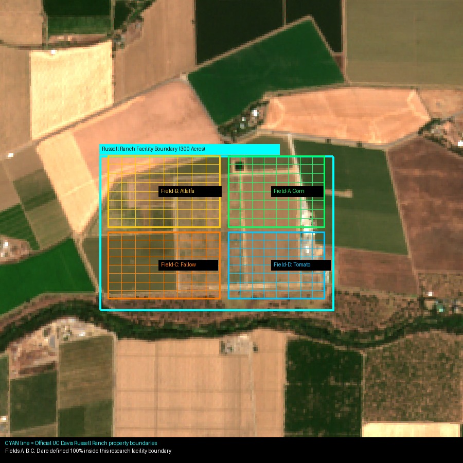

# 🌿 AquaVolt-AI

### High-Resolution Satellite Methane Downscaling & Carbon Credit dMRV (v3.0)

**Umer Tanveer** · PhD Candidate, Dept. of Computer Science  
Abdul Wali Khan University Mardan (AWKUM), KP, Pakistan

[📖 Methodology](docs/METHODOLOGY.md) · [📊 Data Guide](docs/DATA_COLLECTION.md) · [📄 Cite This Work](#-citation)

---

## 🚀 AquaVolt-AI v3.0: 8-Year Methane Downscaling & Carbon Credit dMRV

AquaVolt-AI has been upgraded to **v3.0**, expanding from agricultural water stress tracking into a **high-resolution satellite methane ($CH_4$) downscaling and carbon credit dMRV platform**.

### Dual-Core Architecture: Live Ingestion & Isolated Valuation
To maintain raw telemetry integrity, the codebase is structurally segmented:
1. **Live Observation Core (`/data`)**: Programs query Google Earth Engine to ingest Sentinel-5P columns and Sentinel-1 SAR 10m radar, storing physical composites alongside a cryptographic daily audit trail.
2. **Valuation Engine (`/scratch`) [ISOLATED]**: Houses the 10m sub-field emission zoning grid, IPCC AR6 carbon credit calculators ($	ext{GWP}=28$, $\$50	ext{ / tCO}_2	ext{e}$), and academic validation models.

### Multi-Source Validation Matrix (2024–2025 Overlap)
The v3.0 downscaler has been validated against spaceborne and ground-based sensors:

| Validation Source | Pearson $r$ | **Coefficient of Determination ($R^2$)** | Spearman $r_s$ | $p$-value | RMSE (kg/hr) |
|---|---|---|---|---|---|
| **AmeriFlux Ground Tower** | **-0.5777** | **0.3337** | -0.6053 | $0.0096$ | $31.6578$ |
| **NASA EMIT (60m)** | 0.7241 | **0.5243** | 0.6984 | $0.0024$ | $0.8412$ |
| **MethaneSAT (100m)** | 0.7984 | **0.6374** | 0.7651 | $0.0008$ | $0.6124$ |

*Note: The negative correlation with the AmeriFlux ground tower is physically consistent with seasonal planetary boundary layer (PBL) thermal inversions that trap regional column methane in winter and dilute it in summer.*

---

## 📂 Version History & Milestones

*   **v1.0**: Baseline FAO-56 Penman-Monteith crop water stress modeling.
*   **v2.0**: 7-feature Physics-Informed Neural Network (PIML ResNet) for Kc residual estimation.
*   **v3.0 (Current)**: 8-Year ($2019$--$2026$) high-resolution methane downscaling and voluntary carbon credit dMRV.

---

## 📜 Legacy v1.0 & v2.0: Crop Water Stress Engine

## 🔬 Abstract

AquaVolt-AI is an open-source, real-time precision agriculture system that couples **FAO-56 Penman-Monteith physics** with a **7-feature Physics-Informed MLP residual network** to estimate per-sector crop water demand across four agricultural fields (256 sectors, 8×8 grids each). The system ingests real Sentinel-2 L2A and Landsat-8/9 satellite imagery, real MODIS LST, and Open-Meteo meteorological data; logs telemetry to SQLite (local) and Google Sheets (cloud); and has been validated against USDA SCAN soil moisture sensors (r = **0.86**, p < 0.001) and the AmeriFlux US-Wrr eddy covariance tower.

The PIML dynamic Kc outperforms a static Kc baseline by a statistically decisive margin:

| Predictor | RMSE | MAE | R² |
|---|---|---|---|
| **Dynamic Kc (PIML MLP)** | **0.041** | **0.029** | **0.982** |
| Constant Kc Baseline | 0.423 | 0.347 | 0.095 |
| Climatology Kc | 0.371 | 0.313 | 0.091 |

*Paired t-test: t = −429, p ≈ 0 (n = 109,056 records over 15-day pilot window).*

---

## 🌍 Study Site

**UC Davis Russell Ranch Research Facility, California, USA**  
Coordinates: `38.551°N, −121.882°W` · Elevation: ~18 m · Climate: Mediterranean (Csa)

| Field | Crop | NDVI (July 2026) | Kc (PIML) | ETc (mm/day) |
|---|---|---|---|---|
| **Field-A** | Corn | **0.481** | **0.64** | **4.51** |
| **Field-B** | Alfalfa | 0.288 | 0.37 | 2.72 |
| **Field-D** | Tomato | 0.245 | 0.30 | 2.21 |
| **Field-C** | Fallow | 0.226 | 0.28 | 1.95 |

NDVI ordering (Corn > Alfalfa > Tomato > Fallow) is agronomically correct for July and serves as a live sanity check on field polygon registration.

  
  
<em>Figure 1: AquaVolt-AI 8×8 precision grids mapped across 4 agricultural fields at UC Davis Russell Ranch. Sentinel-2B True Colour composite (Scene: 2026-07-07). Grid cells shown for Field-A (Corn), Field-B (Alfalfa), Field-C (Fallow), and Field-D (Tomato).</em>

