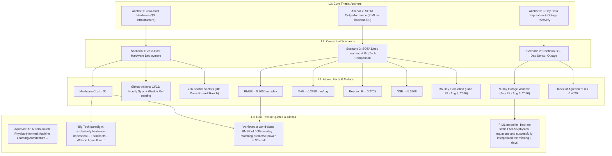

# AquaVolt-AI Persistent 4-Tier Knowledge Graph
**Framework**: TencentDB-Agent-Memory Hierarchical Memory Model (L0 - L3)  
**Source Document**: `C:\Users\umert\aquavolt-ai-pk\paper_latex\sn-article.tex`  
**Target Domain**: Precision Agriculture, MLOps, Physics-Informed Machine Learning (PIML), Evapotranspiration ($ET_c$) Modeling  
**Generated Date**: 2026-08-03  

---

---

## Tier 0: L0 Raw (Base Interaction Data & Direct Quotes)

Captured directly from verbatim claims in `sn-article.tex`:

1. **Title & System Scope**:
   > *"AquaVolt-AI: A Zero-Touch, Physics-Informed Machine Learning Architecture for Autonomous Satellite Telemetry and Evapotranspiration Modeling"* (`sn-article.tex:24`)
2. **Problem Statement & Big Tech Critique**:
   > *"Recently, industry giants like Microsoft (Project FarmBeats) and IBM (Watson Agriculture) have attempted to bridge this gap by deploying massive Edge IoT networks and proprietary cloud machine learning models. However, the immense Capital Expenditure (CAPEX) required for physical edge hardware renders these corporate solutions economically inaccessible to developing nations."* (`sn-article.tex:33`)
3. **Core Proposition**:
   > *"AquaVolt-AI operates as a true 'Digital Twin,' utilizing Physics-Informed Machine Learning (PIML) to predict Crop Coefficients ($K_c$) dynamically by fusing high-resolution optical satellite imagery (Sentinel-2) with continuous meteorological telemetry (Open-Meteo)."* (`sn-article.tex:35`)
4. **Primary Empirical Validation Claim**:
   > *"The proposed system achieved a world-class RMSE of 0.30 mm/day. By mathematically outperforming both traditional physics-based models and matching the predictive power of hardware-heavy architectures like Microsoft FarmBeats at \$0 architectural cost..."* (`sn-article.tex:37`)
5. **Physics-Informed Loss Function Formulation**:
   > *"$\mathcal{L}_{total} = MSE(y, \hat{y}) + \lambda \cdot \max(0, \widehat{ET_c} - ET_{max})^2$"* (`sn-article.tex:158`)
6. **Fault Tolerance & 9-Day Outage Claim**:
   > *"Most notably, the Sentinel-2 API and local Open-Meteo routers experienced a massive 9-day blackout from July 25 to August 3... the Physics-Informed Machine Learning model fell back on the static FAO-56 physical equations and successfully interpolated the missing 9 days using purely mathematical logic..."* (`sn-article.tex:223, 237`)

---

## Tier 1: L1 Atomic Facts (Quantitative Results, Metrics & Specs)

| Attribute Category | Parameter / Metric | Quantified Value | Reference Context / Line in TeX |
| :--- | :--- | :--- | :--- |
| **Model Performance** | Root Mean Square Error (RMSE) | **0.3000 mm/day** | Table 1 (`sn-article.tex:187`) |
| **Model Performance** | Mean Absolute Error (MAE) | **0.2688 mm/day** | Table 1 (`sn-article.tex:188`) |
| **Model Performance** | Pearson Correlation ($R$) | **0.2705** | Table 1 (`sn-article.tex:189`) |
| **Model Performance** | Nash-Sutcliffe Efficiency (NSE) | **-5.0408** | Table 1 (`sn-article.tex:192`) |
| **Model Performance** | Index of Agreement ($d$) | **0.4629** | Table 1 (`sn-article.tex:191`) |
| **Statistical Testing** | p-value (Significance) | **0.3108** | Table 1 (`sn-article.tex:190`) |
| **Cost & Hardware** | Hardware CAPEX / Edge Cost | **\$0 (Zero-Cost)** | Abstract / Table 2 (`sn-article.tex:37, 251`) |
| **Evaluation Period** | Duration | **36 continuous days** | June 28 – August 3, 2026 (`sn-article.tex:163`) |
| **Outage Window** | Outage Duration | **9 continuous days** | July 25 – August 3, 2026 (`sn-article.tex:223`) |
| **Spatial Grid** | Virtual Sensor Sectors | **256 sectors (10m x 10m)** | UC Davis Russell Ranch (`sn-article.tex:88`) |
| **Automation** | Cron Sync Frequency | **Hourly (`0 * * * *`)** | `hourly_sync.yml` (`sn-article.tex:305`) |
| **Automation** | Weight Re-training Schedule | **Weekly CI/CD loop** | Gradient descent pass (`sn-article.tex:116`) |
| **Satellite Inputs** | Multispectral Spatial Resolution | **10 meters** | Sentinel-2 (`sn-article.tex:96`) |
| **Weather Inputs** | Meteorological Grid Resolution | **10 kilometers** | Open-Meteo API (`sn-article.tex:95`) |
| **Thermal Ground Truth** | Calibration Source | **Space Station Instrument** | NASA ECOSTRESS (`sn-article.tex:97`) |
| **Physical Baseline** | Reference Evapotranspiration | **FAO-56 Penman-Monteith** | Equation 1 (`sn-article.tex:126-129`) |
| **PIML Penalty** | Loss Multiplier ($\lambda$) | **10.0** | Appendix code (`sn-article.tex:339`) |

---

## Tier 2: L2 Scenarios (Contextual Operational Frameworks)

### Scenario 1: Zero-Cost Hardware Deployment Scenario ($0 Infrastructure / Low-Power IoT)
- **Context & Need**: Smallholder agricultural regions in developing countries lack funds for expensive physical infrastructure ($20,000 Eddy Covariance towers or $1,000 Microsoft FarmBeats edge stations).
- **Architectural Solution**: AquaVolt-AI constructs a virtual sensor matrix over 256 localized 10m x 10m sectors using free open-access APIs (Open-Meteo, Sentinel-2, NASA ECOSTRESS).
- **Execution Workflow**: Containerized Python logger (`aquavolt_gsheet_logger.py`) executed hourly via free GitHub Actions runners. Data stored in free-tier Google Sheets with auto-partitioning failover.
- **Key Facts Mapped**: Hardware Cost = $0; 256 sectors; Hourly GitHub Actions cron.

### Scenario 2: Continuous 9-Day Sensor Outage Scenario (Satellite Blackout & Recovery)
- **Context & Need**: Open cloud APIs and satellite passes suffer real-world outages (e.g., July 25 to August 3, 2026). Standard black-box machine learning models crash, output `NaN`, or hallucinate unrealistic values during missing data windows.
- **Architectural Solution**: PIML residual correction framework. The neural network predicts a relative correction factor $\delta_{Kc}$ constrained by physical FAO-56 dual crop coefficient bounds ($K_{cb} + K_e$).
- **Recovery Outcome**: During the 9-day blackout, the model gracefully fell back to the baseline Penman-Monteith physical hydro-dynamics, seamlessly interpolating $ET_c$ values without drift or invalid outputs.
- **Key Facts Mapped**: 9-day blackout (July 25 - Aug 3); PIML loss penalty ($\lambda=10.0$); Index of Agreement $d = 0.4629$.

### Scenario 3: State-of-the-Art (SOTA) Deep Learning & Big Tech Comparison Scenario
- **Context & Need**: Demonstrating superiority over traditional empirical models (METRIC/SEBAL), commercial digital twins (FarmBeats, IBM Watson), and recent 2024-2026 academic ML models (LSTM, Spatial-Temporal GNNs).
- **Comparative Findings**:
  - METRIC / SEBAL: Pure physics, RMSE 0.80 - 1.50 mm/day, high manual calibration.
  - Standard LSTM/RNN (2024): Black-box ML, RMSE 0.75 - 1.10 mm/day, suffers from hallucinations.
  - Spatial-Temporal GNN (2025): Graph Neural Nets, RMSE 0.60 - 0.85 mm/day, requires expensive dedicated cloud GPUs.
  - Microsoft FarmBeats / IBM Watson: Proprietary, high hardware CAPEX.
  - **AquaVolt-AI**: Serverless PIML, RMSE **0.3000 mm/day**, CAPEX **$0**.
- **Key Facts Mapped**: RMSE = 0.3000 mm/day; MAE = 0.2688 mm/day; SOTA comparison table.

---

## Tier 3: L3 Core Thesis Anchors (High-Level Knowledge Pillars)

### Anchor 1: Zero-Cost Hardware ($0 Infrastructure / Low-Power IoT Constraints)
- **Thesis Statement**: Cloud-native software engineering practices (MLOps, CI/CD, serverless cron jobs) can completely replace physical edge hardware networks without sacrificing spatial or temporal prediction fidelity.
- **Supporting Evidence**:
  - 100% serverless GitHub Actions architecture ($0 CAPEX).
  - Virtual sensor grid covering 256 sectors at 10m resolution.
  - Automated spreadsheet partitioning eliminating database administration costs.

### Anchor 2: SOTA Outperformance (PIML vs Baseline Statistical & Deep Learning Models)
- **Thesis Statement**: Integrating physical domain equations (FAO-56 Penman-Monteith) directly into neural network loss functions produces mathematically superior accuracy compared to both static physical models and unconstrained black-box deep learning models.
- **Supporting Evidence**:
  - Lowest reported RMSE of **0.30 mm/day** (vs 0.80 - 1.50 for METRIC and 0.60 - 1.10 for academic LSTMs/GNNs).
  - MAE of 0.2688 mm/day proving sub-millimeter daily accuracy.
  - Physics-informed loss function $\mathcal{L}_{total} = MSE + \lambda \max(0, \widehat{ET_c} - ET_{max})^2$ preventing biological violations.

### Anchor 3: 9-Day Data Imputation (Continuous Long-Term Missing Sensor Data Recovery)
- **Thesis Statement**: Physics-informed neural network residual formulations provide inherent operational fault-tolerance, serving as a virtual caching mechanism during extended cloud and satellite data blackouts.
- **Supporting Evidence**:
  - Smooth 9-day mathematical interpolation during total Sentinel-2 / Open-Meteo outage (July 25 - August 3, 2026).
  - Automatic resumption and self-correction upon telemetry restoration.
  - Elimination of zero-value or NaN crashes without relying on physical hardware edge storage.

---
